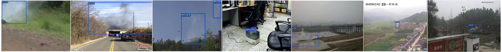

## Introduction
Self-Atention and Self-Cooperation YOLOX (SASC-YOLOX) is an improved network based on YOLOX, with simple strategies but significant performance! It aims to extract precise features and is applied to smoke detection. This repo is an implementation of PyTorch version SASC-YOLOX.

In addition, we provide a smoke dataset composed of real smoke images and annotate it manually, termed the annotated real smoke of Xi’an Jiaotong University (XJTU-RS). These real images are from two benchmark datasets: [CVPR](https://cvpr.kmu.ac.kr/) and [USTC](http://smoke.ustcdu.cn/datasets.html). Our [XJTU-RS](https://pan.baidu.com/s/15OjjiqiFXYHkzgbyIKP4QQ) dataset is available, and code is <b>CIFR<b>.


<!-- For more details, please refer to our [report on Arxiv](https://arxiv.org/abs/2107.08430). -->

<!--  -->

## Benchmark

#### Standard Models.

|Model   |size  |AP|AP<sub>50|AP<sub>75|AP<sub>S|AP<sub>M|AP<sub>L|AR|Params<br>(M)|weights|
| ------ |:---: | :---:    | :---:       |:---:     |:---:  | :---: | :----: | :----: | :----: | :----: |
|YOLOX        |640  |0.683 |0.953 |0.766 |0.388 |0.602 |0.716 |0.678 |8.94| [down](https://pan.baidu.com/s/1CwqDfc1PfPjf_CGygQiLxA?pwd=2ld9) |
|SASC-YOLOX   |640  |0.726 |0.964 |0.817 |0.535 |0.647 |0.753 |0.714 |8.94| [down](https://pan.baidu.com/s/1XVGC1qMVwLTx15qdp-yOww?pwd=l0jf) |

## Quick Start

<details>
<summary>Installation</summary>

Step1. Install SASC-YOLOX.
```shell
git clone git@github.com:jingjing-maker/SASC-YOLOX.git
cd SASC-YOLOX
pip3 install -U pip && pip3 install -r requirements.txt
pip3 install -v -e . 
```

Step2. Install [pycocotools](https://github.com/cocodataset/cocoapi).

```shell
pip3 install cython; pip3 install 'git+https://github.com/cocodataset/cocoapi.git#subdirectory=PythonAPI'
```

</details>

<details>
<summary>Demo</summary>

# Configuration
Step1. Download a pretrained model from the benchmark table.

Step2. Use either -n or -f to specify your detector's config. For example:

```shell
python tools/demo.py image -n yolox-s -c /path/to/your/yolox_s.pth --path ./test_img/002941.jpg --conf 0.25 --nms 0.45 --tsize 640 --save_result --device [cpu/gpu]
```
or
```shell
python tools/demo.py image -f exps/default/yolox_s.py -c /path/to/your/yolox_s.pth --path ./test_img/002941.jpg --conf 0.25 --nms 0.45 --tsize 640 --save_result --device [cpu/gpu]
```
python tools/demo.py image -f exps/default/yolox_s.py -c weights/yolox_s.pth --path ./test_img/002941.jpg --conf 0.25 --nms 0.45 --tsize 640 --save_result --device [gpu]


Demo for video: 
python tools/demo.py video -n yolox-s -c /path/to/your/yolox_s.pth --path /path/to/your/video --conf 0.25 --nms 0.45 --tsize 640 --save_result --device [cpu/gpu]
```

</details>

<details>
<summary>Reproduce our results on COCO</summary>

Step1. Prepare COCO dataset
```shell
cd <YOLOX_HOME>
ln -s /path/to/your/COCO ./datasets/COCO
```

Step2. Reproduce our results on COCO by specifying -n:

```shell
python tools/train.py -n yolox-s -d 1 -b 64 --fp16 -o [--cache]  # -d 8
                         yolox-m
                         yolox-l
                         yolox-x
```


* -d: number of gpu devices
* -b: total batch size, the recommended number for -b is num-gpu * 8
* --fp16: mixed precision training
* --cache: caching imgs into RAM to accelarate training, which need large system RAM. 

When using -f, the above commands are equivalent to:
```shell
python tools/train.py -f exps/default/yolox_s.py -d 8 -b 64 --fp16 -o [--cache]
                         exps/default/yolox_m.py
                         exps/default/yolox_l.py
                         exps/default/yolox_x.py
```

**Multi Machine Training**

We also support multi-nodes training. Just add the following args:
* --num\_machines: num of your total training nodes
* --machine\_rank: specify the rank of each node

Suppose you want to train YOLOX on 2 machines, and your master machines's IP is 123.123.123.123, use port 12312 and TCP.  
On master machine, run
```shell
python tools/train.py -n yolox-s -b 128 --dist-url tcp://123.123.123.123:12312 --num-machines 2 --machine-rank 0
```
On the second machine, run
```shell
python tools/train.py -n yolox-s -b 128 --dist-url tcp://123.123.123.123:12312 --num-machines 2 --machine-rank 1
```

</details>


<details>
<summary>Evaluation</summary>

We support batch testing for fast evaluation:

```shell
python tools/eval.py -n  yolox-s -c yolox_s.pth -b 64 -d 1 --conf 0.001 [--fp16] [--fuse]
                         yolox-m
                         yolox-l
                         yolox-x
```

* --fuse: fuse conv and bn
* -d: number of GPUs used for evaluation. DEFAULT: All GPUs available will be used.
* -b: total batch size across on all GPUs

To reproduce speed test, we use the following command:
```shell
python tools/eval.py -n  yolox-s -c yolox_s.pth -b 1 -d 1 --conf 0.001 --fp16 --fuse
                         yolox-m
                         yolox-l
                         yolox-x
```

</details>


## Deployment


1.  [MegEngine in C++ and Python](./demo/MegEngine)
2.  [ONNX export and an ONNXRuntime](./demo/ONNXRuntime)
3.  [TensorRT in C++ and Python](./demo/TensorRT)
4.  [ncnn in C++ and Java](./demo/ncnn)
5.  [OpenVINO in C++ and Python](./demo/OpenVINO)


## Third-party resources
* The ncnn android app with video support: [FeiGeChuanShu](https://github.com/FeiGeChuanShu)
* SASC-YOLOX with Tengine support: [BUG1989](https://github.com/BUG1989)
* SASC-YOLOX + ROS2 Foxy: [Ar-Ray](https://github.com/Ar-Ray-code)
* SASC-YOLOX Deploy DeepStream: [nanmi](https://github.com/nanmi)
* SASC-YOLOX ONNXRuntime C++ Demo: [DefTruth](https://github.com/DefTruth)
* Converting darknet or yolov5 datasets to COCO format for SASC-YOLOX: [Daniel](https://github.com/znsoftm)

## Cite SASC-YOLOX
If you use SASC-YOLOX in your research, please cite our work by using the following BibTeX entry:
    
  ( To be continued.)
